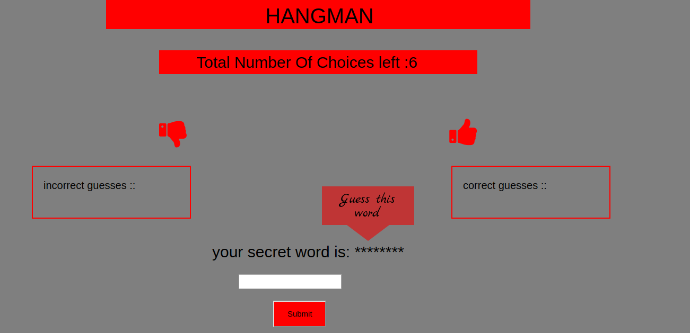

# My Hangman App
### By Anushka Mittal

### Introduction
 The idea is to make a web app, where the user can play a game to guess a word the computer have picked.

### Instructions
- The computer will choose a random word which is related to an online coding course site
- to guess the word, type the letter and click on submit button
- You can make maximum 6 wrong choices

### Usage
- Add both hangman.htm and hangman.js to your text editor
- Open your html file in your favourite browser
